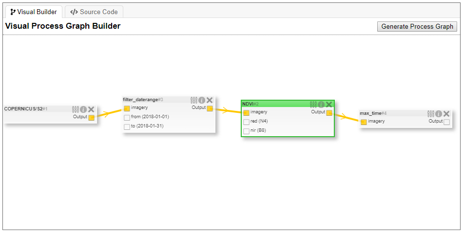

# Visual Process Graph Builder for the Web Editor

A graphical user interface was developed to build process graphs in the web editor visually, like in the ArcGIS model builder.

Code can be found in the [model-builder branch of the openeo-web-editor repository](https://github.com/Open-EO/openeo-web-editor/tree/model-builder).